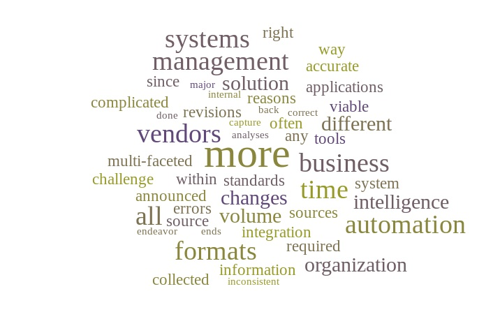

---

#### Frictionless Data, Frictionless Development
---
#### What is data / document management about?

---
#### Means many things to many people
---

#### As a data scientist I want:
* Reproducible analyses - self documenting data retrieval, stored in version control
* Flexibility to work with legacy scripts
* Test-driven data science
* Seamless package management for disparate data sources
---
#### As a developer I additionally want:
* Architectural guidance from the tools I use
* Ability to swap out programming languages and databases
* To store extendable metadata about columns in the data so it is compatible in many places
* Single point of responsibility for each module
---
#### As an ops person I also want
* Declarative tools that are easy to containerise
* Streaming data for low memory usage
* Consistent data formats across varied customers
* A tool appropriate for the data sizes involved (<1M rows per collection)
---
#### What is Zegami and why are Zegami interested in Frictionless data?
* Zegami makes visual information more accesible for exploration, search and discovery
* Zegami allows data scientists to validate machine learning models visually
* Zegami works on top of any tabular data format
---
#### Who are Zegami's users?
* People managment - HR and Schools
* Data scientists
* Museum curators
* Scientists
* Sports coaches and scouts
* Facilities and financial asset managers
---
#### As an evangelist for Zegami I want:
* Interoperability with customer datastores
* To do the right thing - open source, open standards
* Standards that work for both end and CLI tools
* CLI usability for non-coders

---

#### OK, I learn best by doing, so let's build an end-to-end tool using frictionless data's tools

---
#### Imaginary Brief

* Research how styles of railway posters from the National Railway Museum collection have changed over time

---
#### Tasks

* Download and preprocess data and images
* Run some deep learning to find patterns
* Present the results in a ui allowing update of tags

---

#### Which of the frictionless data tools and standards?

* <a href="http://okfnlabs.org/blog/2017/02/27/datapackage-pipelines.html" target="_blank">Datapackage-pipelines</a> - declarative flow control
* <a href="https://github.com/frictionlessdata/tableschema-py" target="_blank">Tableschema-py</a> - to infer the schema and validate new data
* <a href="https://github.com/frictionlessdata/tabulator-py" target="_blank">Tabulator</a> - a common interface for import and export of tabular data
* Standards - <a href="http://frictionlessdata.io/data-packages/" target="_blank">datapackages</a>, <a href="http://dataprotocols.readthedocs.io/en/latest/json-table-schema.html" target="_blank">json table schema</a>,  <a href="https://github.com/frictionlessdata/datapackage-pipelines" target="_blank"> datapackage-pipeline</a> spec
* Other interoperable tools along the way

---
#### OK so where do we start?

---

#### Get tabular data from a jsonapi source

---
#### Intro to tabulator-py

* Tabulator-py is the successor project to "messytables"
* A library for reading and writing tabular data (csv/xls/json/etc).
* Reads data from local, remote, stream or text sources
* Custom loaders, parsers and writers
---
#### Interface

    from tabulator import Stream

    with Stream('http://my-url/path.csv', headers=1) as stream:
        stream.headers # [header1, header2, ..]
            for row in stream:
                    row  # [value1, value2, ..]

---

* The (custom) parser used is set by changing the format parameter and passing in a class

    with Stream(
        "http://source_uri", 
        custom_parsers={'json-api': CustomParser}
        format="json-api"
        ) as stream:
        
        stream.read()
---

#### What do we want our custom parser to do? 

* Let's write a test...

+++?code=smdataproject/tests/test_parser.py&lang=python

@[17](Test data url (see below))
@[20-21](Pass in our custom parser) 
@[25-29](Check we get a single item json out in the correct format)

+++

#### Test data

* Hosted on github because we don't want to patch http or hammer external API

+++?code=data/smdatasetpagenumber0&lang=json

@[546](Changed the next link to test pagination)

+++

* Let's make that pass
* Use the <a href="https://github.com/frictionlessdata/tabulator-py/blob/563e3cc9355e456d2da309990ad8b8354b4ce180/tabulator/parsers/json.py" target="_blank">tabulator json parser</a> as a template.

+++?code=smdataproject/jsonapi_parser.py&lang=python

@[68](Add a pagination loop)
@[73](Set the startng row number on each iteration)
@[83-89](Get the next page url and load in data for next loop)
@[90-91](Break out of the loop if no next link)

---

#### Make the parser support normalisation

* We would like to convert the json to an array of the desired fields
* tabulator.Stream is already using ijson parser 
* This has support for iterating keys in json
* We can pass in a schema which encodes the exact json normalisation desired

---

#### Which fields do we want and what are they called in ijson language?

* Parse the json and print a field list, for example:

+++?code=smdataproject/generate_field_list.py&lang=python

+++?code=data/fieldlist.yaml&lang=yaml

+++

* Examples:
@[5-6](The id)
@[561-562](The title/name of the poster)

---

#### Now we know what we are aiming for we can write a test

+++?code=smdataproject/tests/test_normalising_parser.py&lang=python

@[42-58](Added the schema with our ijson paths)
@[68](Pass the schema into the new parser)
@[71-118](Cheat with the assertion by first printing stuff until it looks right...)

---

#### Make a few assumptions based on what I have needed over the years

---

* The high level data array required is still passed separately to the parser
* We always want to parse single values of type string, number or boolean
* Where those values are repeated due to lists or lists of dicts, concatenate them

---

#### The end result

+++?code=smdataproject/normalising_parser.py&lang=python

@[65-87](Use ijson to iterate json in an event-driven way)

* Similar to native Java JSON Object building
* Ask me about this afterwards if you want to know more

---

* Now need to download images in a pipeline after we get the data
* Need a pipeline spec yaml file

+++?code=smdataproject/pipeline-spec.yaml&lang=yaml

@[1-10](Add some metadata)
@[12-15](Add the data package arguments)
@[53-56](Custom job to download the data)
@[56-62](Custom job to download the images)

---
* Simple custom job stream_remote_resources_custom

+++?code=smdataproject/stream_remote_resources_custom.py&lang=python
@[3](Monkey-path the custom module)

---
* Another custom job for download_images
* This time we need to edit the data and add an image field
+++?code=smdataproject/download_images.py&lang=python
@[11-20](Initially we update the datapackage to include a local field name)
---
# OK so let's run our first pipeline

We install the dependencies like this:

---
# Now for the deep learning step using pandas, tensorflow and keras

---
* Now we have the images downloaded, I have some pandas code to integrate
* Pandas code uses `read_csv` which is not streaming
* Create new pipelines which depend on the initial one
---
# Back to our pipeline

---

+++?code=smdataproject/pipeline-spec.yaml&lang=yaml

@[65-69](Dump out the data)
@[71-85](Add a step to run feature extraction as a subprocess)
@[71-85](Add a step to run feature extraction as a subprocess)
@[86-98](Run the dimensionality reduction step to convert the feautres to a scatter plot)

---
# Custom job to run a subprocess

---
+++?code=smdataproject/run_shell_command.py&lang=python
@[37-39](pass in the arguments from parameters)
@[16-23](Ensure subprocess output is logged)
@[6-8](Use logging module not print)

---
# For more on the deep learning scripts used see <a href="https://tech.zegami.com/comparing-pre-trained-deep-learning-models-for-feature-extraction-c617da54641" target="_blank">Roger Noble's blog post here</a>

---
* The output from the feature extraction looks like this:

    id,x,y
    1975-8398,18.7974,-14.4037
    2000-7803,3.64917,10.2163
    1977-5672,6.50948,21.1126

* We need to join this to our original dataset, we can do this with datapackages pipelines

---

+++?code=smdataproject/pipeline-spec.yaml&lang=yaml

@[106-125](Tell datapackages-pipelines about the data we just created)
@[137-150](Join the datasets together - can be either a format string or a list)
@[152-155](Dump out the finished data)

---

# And this is what the data looks like in Zegami

---

# Conclusions from the railway poster project
* The training data is from resnet - need a network trained on fonts and layout instead to study poster design
---
# Conclusions after using frictionless data projects
* Tabulator has a great interface and is really flexible and well tested
* The datapackage pipelines spec is great, as is the CLI
* We have many ideas for how we would like to improve the underlying codebase and would love for others to join us working on it
---
#### OK so what else can the frictionless data tools do for me?

---

#### <a href="http://frictionlessdata.io/tools/" target="_blank">frictionlessdata.io/tools/</a>

* Lightweight standards and tooling to make it effortless to get, share, and validate data

---
#### Tableschema makes data transfer easy:
* <a href="https://github.com/frictionlessdata/tableschema-bigquery-py" target="_blank">Store in BigQuery</a>
* <a href="https://github.com/frictionlessdata/tableschema-pandas-py" target="_blank">Use in Pandas</a>
* <a href="https://github.com/frictionlessdata/tableschema-sql-py" target="_blank">Convert to SQL with tableschema sql</a>
* <a href="https://github.com/frictionlessdata/tableschema-elasticsearch-py" target="_blank">Create an elasticsearch index with tableschema-elasticsearch-py</a>
* <a href="https://github.com/frictionlessdata/tableschema-spss-py" target="_blank">Pull data from SPSS</a>
* Coming soon - go contribute : <a href="https://github.com/frictionlessdata/tableschema-ui" target="_blank">Edit your schemata with tableschema-ui</a>
---
####  Tableschema lets you switch languages
* Understand your data in <a href="https://github.com/frictionlessdata/tableschema-ui" target="_blank">Java
* Switch to <a href="https://github.com/frictionlessdata/tableschema-go"  target="_blank">Golang for a project
* Work with <a href="https://github.com/frictionlessdata/tableschema-rb"  target="_blank">Ruby</a>
* Coming soon: Clojure and R
---
#### Using the tableschema standard allows use of many repository owners' tools
* Repository management with <a href="https://ckan.org/features/" target="_blank">CKAN</a>
* Lighter weight repository managment with <a href="https://github.com/datahuborg/datahub" target="_blank">MIT's datahub</a>
* Update apis for the data from data packages with <a href="http://okfnlabs.org/blog/2014/09/11/data-api-for-data-packages-with-dpm-and-ckan.html" target="_blank">CKAN datastore</a>
* Data package distribution with <a href="http://okfnlabs.org/projects/dpm/" target="_blank">dpm</a>

---
# Summary

* Frictionless data and OKFN have created some time-saving tools and standards
* The community is great, pull requests are merged quickly
* When you are struggling with a data model for a task or a schema, frictionless data's standards provide guidance
* Tools tend to be well balanced in terms to who has influenced their development

---

# Acknowledgments

* Thanks to the team at Frictionless data / OKFN
* Thanks to the team at <a href="http://okfnlabs.org/blog/2017/02/27/datapackage-pipelines.html" target="_blank">Openspending for creating the datapackage pipelines project</a>
* To the team at Zegami
* To everyone for listening